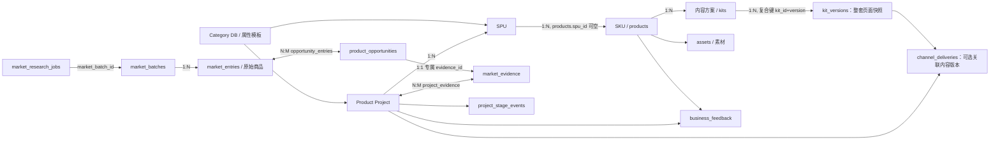

# V8 Product Workflow Refactor · Phase 0 产品审计

审计日期：2026-09-21。范围仅为现有源码、API 契约与本机 `.runtime/workbench.sqlite` 的只读核对；本阶段未改动业务代码、页面或数据库，也未把两份 Word 评审当成系统事实。`F:/File/设计如何使用.docx` 与 `F:/File/问题.docx` 提供待验证判断，用户粘贴的 V8 任务说明规定本次边界。

分类口径：**A VERIFIED**＝判断被代码/数据证实；**B PARTIALLY_TRUE**＝界面症状成立，但内部实现推断不准确；**C FALSE_INFERENCE**＝从截图得到的结论与实现相反；**D DESIGN_PROPOSAL**＝新产品设计取舍，不是已证实的缺陷。截图中的数量仅代表拍摄时；下列数量为本次数据库只读查询结果。

## 当前数据与关系基线

数据库 `user_version=7`。现有 3 个类目、1 个类目属性模板、1 个市场研究任务、3 个市场批次、94 条原始商品记录、14 条 `market_evidence`、13 个机会、394 条机会—商品记录关联、4 条项目—证据关联、3 个项目、1 个 SPU、2 个 SKU、2 套 kit、33 个 kit 版本、1 条渠道交付、1 条经营反馈、32 个内容 job、44 个内容 task、1 条导出。`PRAGMA foreign_key_check` 返回 0 行。两个 SKU 中一个归属 LEADR SPU，另一个 `spu_id=NULL`，属于允许独立建档的旧路径；不能声称每个 SKU 都属于项目。3 个项目分别处于 `LAUNCHED`、`EVALUATING`、`DRAFT`；后两个项目目前没有 SPU/SKU。机会状态为 6 `DRAFT`、5 `READY`、2 `REJECTED`。研究任务处于 `COMPLETED`，记录扫描 1938、有效 33、机会 3。44 个内容 task 当前为 26 成功、17 失败、1 待人工核对；这是历史状态分布，不等于当前正在排队或页面卡死。

关系的三个限制：① `product_opportunities.evidence_id` 有 `UNIQUE`，故一条机会对应一条专属摘要证据；其**多条底层商品证据**保存在可复用的 `opportunity_entries`，并非“多条 `market_evidence` 直接从属于同一机会”。② 项目与机会没有直接 FK，通过机会的 `evidence_id → project_evidence` 关联；一个 `market_evidence` 可被多个项目引用，商品记录也可被多个机会引用。当前 94 条商品记录均被至少两个机会引用过，但目前还没有同一条 `market_evidence` 被多个项目引用的实例，**结构允许复用，实例尚未演示**。③ 研究任务只引用产出批次，不引用发起项目或类目；项目反查批次依赖已关联机会证据中的分析 JSON，而不是正式的项目—研究任务 FK。[Schema：business-migration.ts](../apps/server/business-migration.ts)、[opportunity-migration.ts](../apps/server/opportunity-migration.ts)、[market-research-migration.ts](../apps/server/market-research-migration.ts)。

## 两轮评审逐项核对

| 评审判断 / 要求核实的问题 | 分类 | 核对结论及依据 |
| --- | --- | --- |
| 项目不是 SPU/SKU 的真实容器，无法回答 SKU 属于哪个项目 | **C** | `spus.product_project_id` 与 `products.spu_id` 构成归属，项目详情 API 联表返回 SPU、SKU、kit；只是独立 SKU 可不归属 SPU/项目。项目页能创建 SPU/SKU。见 [business.ts](../apps/server/business.ts)、[business-ui.tsx](../apps/web/src/business-ui.tsx)。|
| 项目详情中 SPU、SKU、内容、交付、反馈五个分区“全无能力” | **B** | 当前两个项目空，是对象不存在；页面有建 SPU/SKU、跳内容制作、记录交付与反馈的入口，内容在项目内为摘要/跳转，交付与反馈可在项目内新增。仍有大面积空区和入口分散问题。见 [business-ui.tsx](../apps/web/src/business-ui.tsx)。|
| 项目页已完全成为工作中枢 | **B** | 具备数据聚合与部分操作，却仍是 8 段顺排；资料编辑、素材上传、内容编辑在独立页面。更具体的问题：`createSku()` 取 `detail.spus[0]`，多 SPU 项目无法指定所属 SPU。见 [business-ui.tsx](../apps/web/src/business-ui.tsx)。|
| 机会与证据没有落地关系、不能查支撑商品 | **C** | 机会有唯一 `evidence_id`，`opportunity_entries` 有 `SUPPORTING/COMPARISON/EXCLUDED` 角色并指向原商品；机会卡已有“代表证据/全部证据”。仍缺完整的独立机会详情与关系可读性。见 [opportunity-migration.ts](../apps/server/opportunity-migration.ts)、[market-insights.tsx](../apps/web/src/market-insights.tsx)。|
| 机会加入项目后仍可被其他项目再次引用，是“未消费”的 bug | **C** | `project_evidence(project_id,evidence_id)` 允许跨项目复用；同一项目重复加入被 `INSERT OR IGNORE` 幂等处理。证据不是一次性资源，**不增加 consumed 状态**。可展示引用项目数/项目列表。见 [market-opportunity.ts](../apps/server/market-opportunity.ts)。|
| 机会—项目没有正式直接 FK，UI 靠下拉加入 | **A** | 项目引用的是机会生成的 `market_evidence`；API 只有“把 READY 机会加入已有项目”，当前没有“由机会创建项目并自动带入”的动作。机会卡选择已有项目。见 [market-opportunity.ts](../apps/server/market-opportunity.ts)、[market-insights.tsx](../apps/web/src/market-insights.tsx)。|
| 机会加入项目后状态应该自动变化 | **D** | `READY` 表示审核通过、可作为立项依据；“已有多少项目引用”是另一维度。加入后不应耗尽机会或强制改变审核态。现有卡片有 `linkedProjectCount`，但缺项目名称/入口。见 [market.tsx](../apps/web/src/market.tsx)。|
| 已否决机会无恢复路径 | **A** | review API 仅接收 `DRAFT`，`REJECTED` 目前不能改为 `READY`；是否需要申诉/再评估是后续流程设计，不应在审计中伪造恢复规则。见 [market-opportunity.ts](../apps/server/market-opportunity.ts)。|
| 内容版本是全局流水号，不知道对应哪个 SKU | **C** | `kit_versions` 主键 `(kit_id,version)`，`kits.product_id/sku_id` 指向 SKU；版本按 kit 单独递增，页面内容存于该版本的 JSON 快照。交付以 `(kit_id,kit_version)` 外键指向真实版本。`v31` 与 `V6` 可以是不同套 kit 的版本。见 [store.ts](../apps/server/store.ts)、[business-migration.ts](../apps/server/business-migration.ts)。|
| 内容版本展示不清，让人误以为是全局号 | **A** | 项目交付摘要仅写“内容版本 Vx”，没有展示 kit/SKU 名；全局交付列表也只显示 Vx，容易误读。页面审核不是独立版本表，随 kit 快照保存。见 [business-ui.tsx](../apps/web/src/business-ui.tsx)。|
| 三套状态“竞争解释同一件事”，应合并为全站唯一状态机 | **C / D** | 三者属于不同实体：项目阶段、机会审核结果、kit 页面审核。共用样式和含糊动词是 **A 类表达问题**；合并成一个状态字段是错误设计，用户粘贴要求也明确保持三套独立词汇。见下方状态机。|
| 评估中却有“推进至已立项”按钮，状态逻辑矛盾 | **B** | `EVALUATING → APPROVED` 是合法下一状态，按钮描述目标态，不代表当前已立项；但动作名称与缺失项没有形成明确因果，页面首屏有多个进度体系。前端 `guidance.nextStatus` 不是“缺失项全部完成才能推进”的守卫；后端主要校验允许的状态边。见 [business.ts](../apps/server/business.ts)、[business-ui.tsx](../apps/web/src/business-ui.tsx)。|
| 品类只是假的展示字符串、没有 schema 或业务规则 | **C / B** | 类目是三层 DB 实体，洗发水有版本化字段模板，SPU/项目类目一致性在 API 校验；但项目表单、面包屑、SPU 字段和市场研究 profile 当前硬编码洗发水，模板没有真正驱动通用表单或研究范围。见 [business-migration.ts](../apps/server/business-migration.ts)、[business.ts](../apps/server/business.ts)、[business-ui.tsx](../apps/web/src/business-ui.tsx)。|
| 市场研究只能 shampoo 是数据库 CHECK 锁死 | **C** | DB `source_platform/collection_profile` 为开放 `TEXT`；限制在 API 输入契约 `z.literal('jd') / z.literal('shampoo')`，UI 也固定只读显示。Collector 桥接和分析选类目目前也按洗发水实现；增加 profile 仍需产品/采集能力，不需仅因该字段改 schema。见 [market-research.ts contract](../packages/contracts/market-research.ts)、[market-research.ts server](../apps/server/market-research.ts)。|
| 项目目前能主动发起市场研究并自动回流 | **A：缺失** | 研究只从市场洞察页新建，`market_research_jobs` 无项目 FK；批次不自动挂项目，机会须人工审核，再加入已有项目。见 [market-research-panel.tsx](../apps/web/src/market-research-panel.tsx)、[market-research-migration.ts](../apps/server/market-research-migration.ts)。|
| 系统完全没有异步任务队列，只靠手动刷新 | **C / B** | 内容有 `jobs/tasks/task_attempts`、lease、失败恢复与轮询；市场有独立 `market_research_jobs`、worker、失败阶段重试及 2 秒页面轮询。页面确有“刷新状态/刷新进度”按钮，也缺跨模块待办聚合。AI 独立分析 `/market/ai-analysis` 是同步 HTTP 调用；V7 自动分析属于研究 job 的 `ANALYZING` 阶段，不是第三个持久 job 表。见 [tasks.ts](../apps/server/tasks.ts)、[market-worker.ts](../apps/server/market-worker.ts)、[jobs.tsx](../apps/web/src/jobs.tsx)、[market-research-panel.tsx](../apps/web/src/market-research-panel.tsx)。|
| “确认当前文案”“本页已审核”在完成态仍可执行 | **B** | 两按钮仍显示，但完成态 `disabled`，不会重复提交；文案修改会把确认态重置为 draft、页面审核重置为 false。应改为只读完成信息，而非修数据库状态。见 [studio-view.tsx](../apps/web/src/studio-view.tsx)、[app.tsx](../apps/web/src/app.tsx)。|
| “批量生成背景 · 0”仍可点击 | **C / B** | 按钮仍显示，`!imagePages.length` 使其禁用；视觉上“0”没有解释，属于零状态表达问题。见 [template-panel.tsx](../apps/web/src/template-panel.tsx)。|
| 工作总览缺具体待办与正在执行的跨模块任务 | **A** | 目前是统计、阶段分布、事件流、最近内容、泛化的“前往产品项目”提示；无逐项待审核机会/任务/缺失项的投影。见 [business-ui.tsx](../apps/web/src/business-ui.tsx)。|
| 产品资料库、渠道交付、经营反馈属于纯空壳且无任何能力 | **B** | 资料库有 SKU 新增/编辑、素材上传与内容入口；渠道交付/反馈各有 1 条记录且在项目内能新增，但顶层页面以全局只读列表为主。是否收起一级导航是 **D 类信息架构决定**，不能据数据量删能力。见 [library-view.tsx](../apps/web/src/library-view.tsx)、[business-ui.tsx](../apps/web/src/business-ui.tsx)。|
| 基础设置是可配置管理页 | **C** | 当前仅展示服务能力与“待试运行”说明，没有用户可操作的配置控件；不是配置管理。将其降级是 **D**。见 [workspace.tsx](../apps/web/src/workspace.tsx)。|
| 状态前缀、原始 SKU 短哈希、技术性 AI 说明、重复口径进入业务 UI | **A** | 机会标题来自数据、部分含“待审核：”；反馈列表显示 `skuId.slice(0,8)`；界面写“AI 只读取上方统计和商品原文”等实现语。重复文案与两条流程提示可在 Phase 1/2 处理，不应改写历史标题数据。见 [market.tsx](../apps/web/src/market.tsx)、[business-ui.tsx](../apps/web/src/business-ui.tsx)、[market-insights.tsx](../apps/web/src/market-insights.tsx)、[studio-view.tsx](../apps/web/src/studio-view.tsx)。|
| 证据搜索/替换/排除、项目内研究、统一任务卡、收敛一级导航 | **D** | 这些是新增交互与可能的接口能力；不能把设计目标记为当前系统 bug。本次只确定实现前提和边界。|

## 三套业务状态与异步状态

1. **Project lifecycle**：`DRAFT` 草稿 → `EVALUATING` 评估中 → `APPROVED` 已立项 → `DEVELOPING` 开发中 → `READY` 待上市 → `LAUNCHED` 已上市；`CLOSED` 可从各活动阶段进入。后端也允许 `EVALUATING → DRAFT`、`READY → DEVELOPING` 回退，以及同态更新；`CLOSED` 仅同态。UI 的“下一步”只给正向路径，不能替代后端全部允许边。[business.ts contract](../packages/contracts/business.ts)、[business.ts server](../apps/server/business.ts)。
2. **Opportunity review**：`DRAFT` 候选 → 人工 `APPROVED` 决策后 `READY`，或人工 `REJECTED` 后 `REJECTED`。review API 仅允许 DRAFT。READY 可关联多个项目；关联不改变审核状态。手工创建机会的输入契约允许指定 `DRAFT/READY/REJECTED`，因此“所有正式机会都经过同一审核 API”目前不成立；V8 若讨论统一口径，需先明确如何对待历史手工机会。[market-opportunity.ts contract](../packages/contracts/market-opportunity.ts)、[market-opportunity.ts server](../apps/server/market-opportunity.ts)。
3. **Content/page review**：kit 页面 `copyStatus: draft → confirmed`；页面 `reviewed: false → true`，编辑文案/素材会重置审核。模板概览 `READY / MISSING_DATA / GENERATING / GENERATED / REVIEWED / FAILED` 是由事实、任务与页面快照**派生的展示态**，不是与项目/机会等价的持久生命周期；页面无独立 revision 主键，随整套 kit 版本保存。[domain.ts](../packages/contracts/domain.ts)、[content-service.ts](../apps/server/content-service.ts)、[app.tsx](../apps/web/src/app.tsx)。

异步执行另有技术状态：内容 task 为 `queued/running/waiting_external/saving_result/needs_reconciliation/succeeded/failed/cancelled`；市场研究为 `CREATED/COLLECTING/NORMALIZING/IMPORTING/ANALYZING/REVIEW_REQUIRED/COMPLETED/FAILED`。两种任务状态可做 UI 投影，但不应合并数据库。刷新页面后，`JobPanel` 重新请求 jobs，模板概览重新读 kit/task，市场面板重新拉取任务；市场面板每 2 秒轮询，内容面板只在有非终态任务时循环拉取。市场与内容用独立 worker，避免长时采集占用内容队列。[tasks.ts contract](../packages/contracts/tasks.ts)、[market-research.ts contract](../packages/contracts/market-research.ts)、[market-worker.ts](../apps/server/market-worker.ts)、[jobs.tsx](../apps/web/src/jobs.tsx)。

## 当前导航与真实能力

| 一级入口 | 当前数据 / 页面职责 | 能做什么 | Phase 0 判断 |
| --- | --- | --- | --- |
| 工作总览 | 3 项目、14 证据、1 SPU、2 SKU 的跨项目摘要 | 跳项目、跳最近内容 | 有业务价值；缺具体待办与执行中任务，不是完整工作台。|
| 市场洞察 | 3 批次、94 原始记录、13 机会、14 摘要证据、1 研究任务 | CSV 导入、原始记录核对、AI 分析、机会审核/加入项目、发起 JD 洗发水研究、人工录入证据 | 独立的跨项目工作域；机会详情与项目派生入口不足。|
| 产品项目 | 3 项目；其中 1 项目有 SPU/SKU，另 2 个为空 | 建项目/改阶段、关联证据、建 SPU/SKU、跳内容、记交付和反馈、看时间线 | 数据容器真实存在；操作优先级与多 SPU 选择需治理。|
| 产品资料库 | 2 SKU、1 SPU；一个 SKU 独立建档 | 编辑 SKU、上传原始素材、新建独立 SKU、跳内容 | 不是只读壳；是否保留顶层取决于未来独立 SKU 工作频率。|
| 内容与创意 | 2 kit、33 个整套版本、17 页模板能力 | 文案/视觉生成、逐页审核、保存/恢复、导出、后台任务 | 真正的生产工作台；当前关联 SKU 而非全局流水。|
| 渠道交付 | 1 条记录 | 全局只读查看；新增在项目页 | 顶层视角较薄，但记录和 API 均真实。|
| 经营反馈 | 1 条记录 | 全局只读查看；新增在项目页 | 同上，不能称数据不存在。|
| 基础设置 | 服务能力展示，非配置数据 | 查看服务状态 | 名称承诺与功能不符；不宜作为业务设置页。|

导航定义见 [app.tsx](../apps/web/src/app.tsx)，全局/项目/交付/反馈页面见 [business-ui.tsx](../apps/web/src/business-ui.tsx)，资料库见 [library-view.tsx](../apps/web/src/library-view.tsx)。侧栏内容 `17` 是当前 kit 的页数，不是待办数。现有数据量不足以证明“全局资料库/交付/反馈永远不应独立”，只能说明当前默认优先级偏高。

## V8 分阶段预计修改范围（尚未批准实施）

| 阶段 | 最短可验证改动 | Schema 判断 | 主要风险/核对点 |
| --- | --- | --- | --- |
| 1 语言与假能力 | 统一三套状态标签映射与动作命名，隐藏/解释零数量动作，去哈希和实现语，设置页降级；优先触及 `apps/web/src/{business-ui,market,market-insights,studio-view,template-panel,workspace,app}.tsx` 与共享状态组件 | 不需 | 不改合法状态边；不误把历史机会标题当状态字段清洗。|
| 2 项目工作台 | 调整 `business-ui.tsx` 项目详情层级；复用 `deriveProjectGuidance`，把下一步动作与真实入口放一起；多 SPU 时显式选择归属 | 原则上不需 | 不能把 UI 提示当后端强制门槛；保留独立 SKU 和历史项目。|
| 3 机会 → 项目 | 在市场机会处提供“审核后创建项目”操作；后端事务复用现有项目创建、证据关联、timeline 规则；保留关联已有项目 | 大概率不需，现有 `project_evidence` 可表达；若要求单独保存“原始发起机会”且不接受证据映射，才需另议 | 并发/重试避免空项目或重复关联；Brief 只带已有事实，不复制 AI 推断为已确认事实。|
| 4 项目 → 研究 | 项目内入口、受支持 profile 的选择、研究任务与发起项目的可追溯关系，完成后由人决定纳入机会/证据 | **可能需要 V8 最小迁移**：`market_research_jobs.initiating_project_id NULL REFERENCES product_projects(id)` 或等价关系表；现有 `market_batch_id` 只能表示产出，不表示发起项目。届时先单独设计、备份、征得批准 | 不自动批准机会，不自动改 Brief；当前只支持 JD/shampoo。|
| 5 导航收敛 | 基于阶段 2–4 的真实入口重排 `app.tsx`，保留全局查阅与独立 SKU 路径 | 不需 | 不能为了“少几个菜单”藏掉素材编辑、历史版本、交付/反馈记录。|
| 6 任务 UX | 以现有 `/jobs` 与 `/market-research-jobs` 做只读 TaskProjection/待办聚合，复用现有轮询与恢复 | 不需 | AI 单次分析并无独立持久 job；不能显示虚构进度或把 `REVIEW_REQUIRED` 当失败。|
| 7 Evidence UX | 在现有记录、角色关联和项目证据上做关键词/来源/批次筛选、详情溯源；替换/排除如要持久化理由须先定义对象语义 | 基础筛选通常不需；**跨分析的排除理由/替换历史**现有关系无法完整表达，若确定要永久留痕，再提最小迁移 | 绝不加“已消费”；保留同证据跨机会/项目复用，避免把商品记录与摘要证据混称。|

因此 **Phase 0 不需要 migration**。V8 后续最明确的 schema 缺口是“哪一个项目发起某次市场研究”；其余先以现有关系完成最小行为验证，再决定是否需要结构化持久记录。任何 schema 调整应另行审批，不在本次审计中实施。

## 需优先关注的风险

1. **来源语义**：研究任务、批次、机会、摘要证据是四类对象。机会的 `market_evidence` 是分析摘要，不等于 33 条原始商品；“证据覆盖”应指 `opportunity_entries`，项目页应能继续追到批次和商品。当前项目页仅对 `ai_product_opportunity_candidate` 解析来源，手工机会/手工证据的追溯呈现较弱。[business-ui.tsx](../apps/web/src/business-ui.tsx)。
2. **多 SPU 正确性**：DB 允许一项目多 SPU，但新建 SKU 的 UI 固定取第一个 SPU；V8 不能只换视觉布局而保留错误归属。[business-ui.tsx](../apps/web/src/business-ui.tsx)。
3. **审核规则口径**：AI 候选必须人工审核；手工机会接口却允许调用方直接提交 READY/REJECTED。若产品要求“所有机会均人工审核”，这是现有合同/行为改变，需明示历史兼容和测试边界。[market-opportunity.ts](../apps/server/market-opportunity.ts)。
4. **空状态与角色认知**：3 个项目中只有一个已有 SPU/SKU，当前空区既反映真实未开展工作，也可能让人以为功能不存在；“有能力”和“有数据”必须分开展示。
5. **历史关联**：kit 版本、页面审核、导出、交付以不同粒度关联；改导航或版本文案不能改主键、把 `v31` 当跨 SKU 全局号，或将页面状态误迁成新的独立版本。
6. **任务反馈**：内容失败/待核对历史较多，任务聚合应保留可恢复性和错误详情；市场研究 `COMPLETED` 不代表机会已加入项目。不要因 UI 收敛抹平两类终态。

本审计为 Phase 0 交付。未执行 V8 Phase 1–7，等待确认后再实施。
